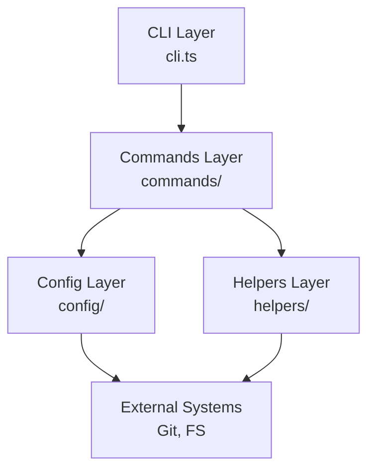
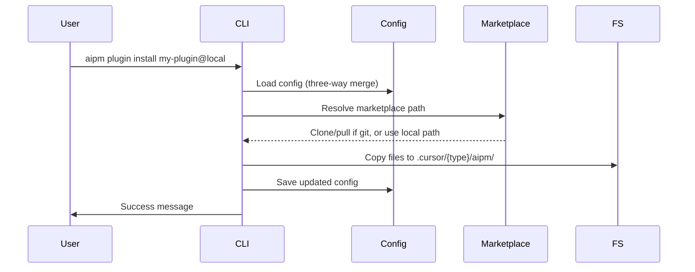
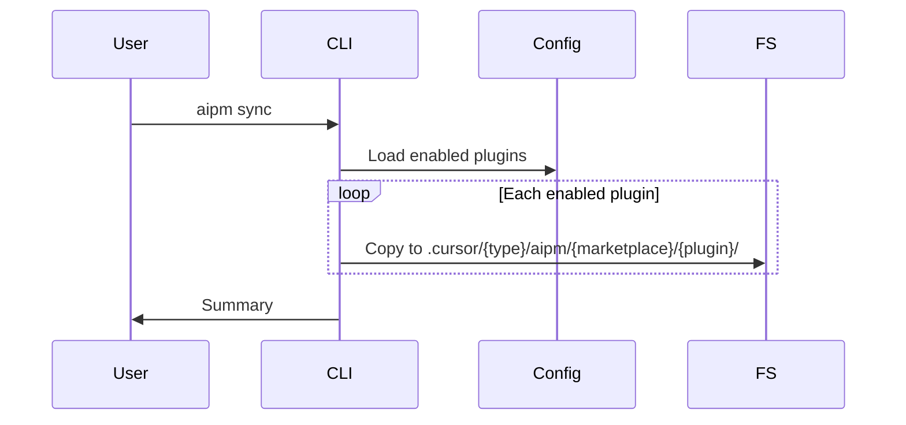
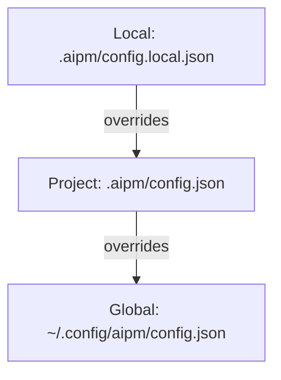
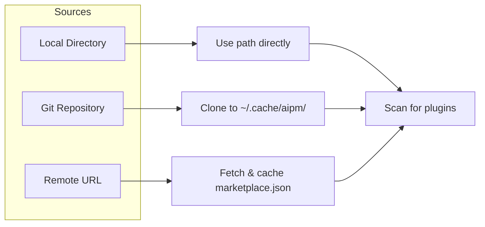

# Architecture Overview

aipm follows a **layered architecture** with clear separation of concerns.

## System Design



| Layer    | Responsibility                      |
| -------- | ----------------------------------- |
| CLI      | Parse arguments, route to commands  |
| Commands | Business logic for each command     |
| Config   | Load, merge, validate configuration |
| Helpers  | Shared utilities (git, fs, sync)    |

---

## Data Flow

### Plugin Installation



### Sync Flow



---

## File Locations

```
~/.config/aipm/config.json          # Global config
~/.cache/aipm/{marketplace}/        # Git marketplace clones

.aipm/
├── config.json                     # Project config (committed)
└── config.local.json               # Local overrides (gitignored)

.cursor/
├── commands/aipm/{marketplace}/{plugin}/
├── rules/aipm/{marketplace}/{plugin}/
├── agents/aipm/{marketplace}/{plugin}/
├── skills/aipm/{marketplace}/{plugin}/
└── hooks/aipm/{marketplace}/{plugin}/
```

---

## Config Priority



---

## Marketplace Resolution



---

## Design Principles

1. **Explicit over implicit** - Config files are explicit, paths are absolute
2. **Composable** - Small functions, utilities work independently
3. **Type-safe** - TypeScript strict mode, Zod validation
4. **Testable** - Dependency injection, pure functions
5. **User-friendly** - `--dry-run`, helpful errors

---

## Extension Points

| Extension            | Steps                                                         |
| -------------------- | ------------------------------------------------------------- |
| New command          | Create `src/commands/my-command.ts`, register in `cli.ts`     |
| New marketplace type | Add to `MarketplaceSource`, update `resolveMarketplacePath()` |
| New sync strategy    | Implement in `sync-strategy.ts`, add config option            |
